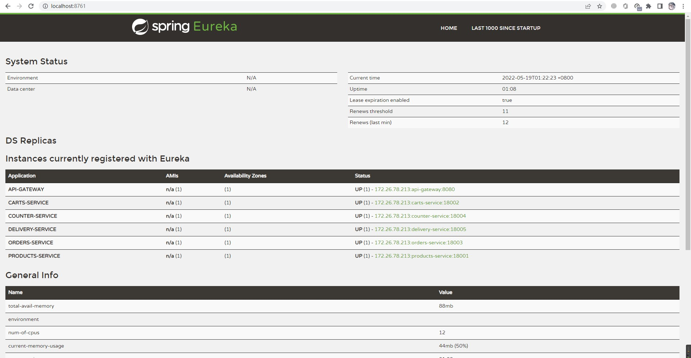

# aw07

### REPORT 报告

完成了要求的Counter收银服务、Order订单服务和Delivery递送服务，并且通过加入`@RabbitListener`等AMQP的组件，通过RabbitMQ进行订单与递送间的消息传递（实现中仅传递了订单号，商品信息仍需从订单页查看）。

在Eureka的监控页上可以看到各服务节点运行良好。

*没有实现前端，因此各项服务通过POSTMAN和浏览器访问等方式进行测试。*

### Original README.md

Please extend your MicroPOS system by adding a delivery service shown as the following figure.

When an order is placed by a user, the order serivce sends out an event into some AMQP MOM (such as RabbitMQ). The delivery service will be notified and a new delivery entry will be generated automatically. User can query the delivery status for his orders.

Use [Spring Cloud Stream](https://spring.io/projects/spring-cloud-stream) to make the scenerio happen. Of coz you can refer to the [demo](https://github.com/sa-spring/stream-loan) for technical details.